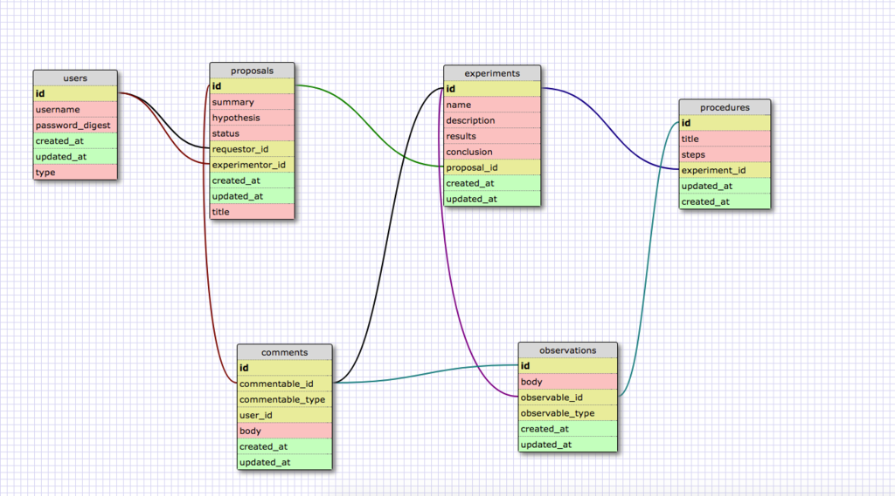
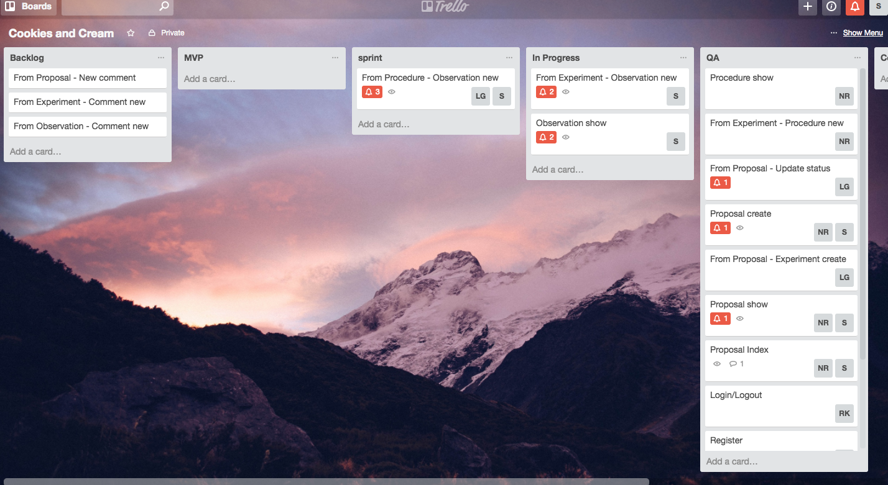
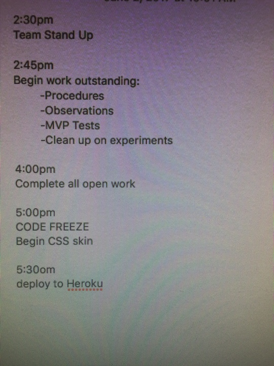

# Master Coders





## Team Members
* Steven Aguilar @theasteve
* Natalie Ruiz @nataliecita
* Richard Kim @richardykim [DECEASED]
* Louis Gaeta @louisgaeta1
* Alexandra Hill @alexnhill
* Lana Chiad @lanachiad

## MVP User Stories
* User logs in and out of app
* User creates an account
* User creates a proposal
* User checks proposal information
* User creates a new experiment
* User updates the status of the proposal
* User creates new procedure
* User creates an observation
* User is able to see procedure information

## Ruby version
* ```Rails 5.0.3```
* ```ruby 2.3.4p301```

## Configuration
*  ```bundle install```

## Database initialization
* ```bundle exec rake db:create```
* ```bundle exec rake db:migrate```
* ```bundle exec rake db:seed```

## How to run the test suite
* ```rails generate rspec:install```
* ```bundle exec rspec```
